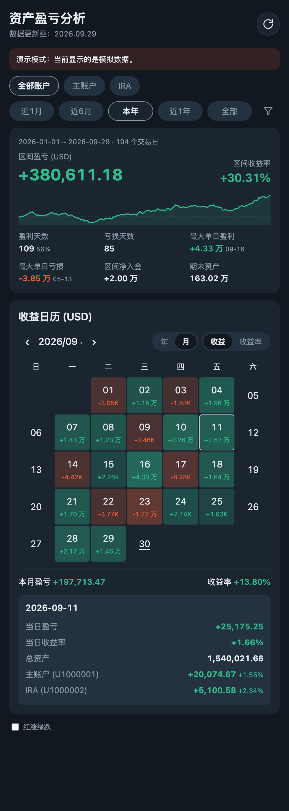
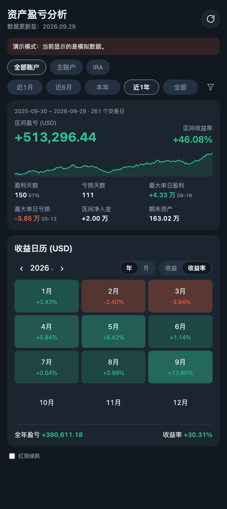

# IBKR 收益日历

这个工具用 IBKR Flex Web Service 每天拉取一次各账户的 NAV（T+1），存进本地 SQLite，然后在网页里展示：

- **收益日历**：有月视图和年视图，可以在"收益（金额）"和"收益率"之间切换，点某一天可以看各账户的明细
- **区间统计**：近1月、近6月、本年、近1年、全部，也可以自定义区间。显示区间盈亏、时间加权收益率、盈亏天数、最大单日盈亏和累计曲线
- **多账户**：可以合并查看，也可以只看单个账户
- 手机浏览器打开体验和 App 接近，也可以"添加到主屏幕"

<p>
  
  
</p>

> 截图使用的是演示模式的模拟数据（`python -m app.demo`）。
>
> 页面支持通过 URL 参数打开指定视图，例如 `/?view=year&metric=ret&range=1y`、`/?day=2026-09-11`。

---

## 一、在 IBKR 后台配置 Flex Query（只需做一次）

登录 IBKR 网页端，进入 **Performance & Reports → Flex Queries**。

### 1. 编辑 Activity Flex Query

你已经建好了 `Daily NAV`，点它右边的 ✏️ 修改即可（新建一个也行）。

**Sections 需要勾选下面这些**（点开每个 section，在里面选 *Select All* 字段）：

| Section | 必选？ | 说明 |
|---|---|---|
| **Net Asset Value (NAV) in Base** | ✅ 必选 | 每日总资产，计算的核心数据 |
| **Cash Transactions** | ✅ 必选 | 里面的选项**只需要勾 `Deposits & Withdrawals`**，Level of detail 选 **Detail** |
| **Transfers** | ✅ 必选 | 账户间现金划转、持仓转入转出。**点开后务必 Select All 字段**，否则只有空记录 |
| **Change in NAV** | 建议 | 用来对账：拉取时会核对明细出入金的合计是否等于 IBKR 的汇总值，不一致会提示 |
| **Conversion Rates** | 可选 | 只有账户的基础货币不是 USD 时才需要 |

**Delivery Configuration / General Configuration** 这样设置：

| 选项 | 值 |
|---|---|
| Accounts | **勾选你的所有账户**（在页面顶部 *Select Account(s)* 里多选）。同一个登录名下的多个账户，一个 Query 就能全部拿到 |
| Format | **XML** |
| Period | **Last 365 Calendar Days**（这是 IBKR 允许的最长期间） |
| Date Format | **yyyyMMdd** |
| Time Format | HHmmss |
| Date/Time Separator | `;`（分号） |

保存即可。

### 2. 找到 Query ID

在 Activity Flex Query 列表里，点 Query 名字左边的 **ⓘ** 图标，弹窗中会显示 **Query ID**（一串数字）。

### 3. 获取 Token

在右侧 **Flex Web Service Configuration** 点 ⚙️，可以看到或生成 **Current Token**。

> Token 有有效期（生成时可以选，最长 1 年）。过期后拉取会报错 `[1012] Token has expired`，到这里重新生成，再更新 `.env` 就行。

---

## 二、安装

需要 Python 3.10 或更高版本。

```bash
git clone <本仓库地址> ibkr-dashboard && cd ibkr-dashboard
```

```bash
python3 -m venv .venv
```

```bash
.venv/bin/pip install -r requirements.txt
```

## 三、填写配置

```bash
cp .env.example .env
```

用编辑器打开 `.env`，至少填这两项：

```ini
IBKR_FLEX_TOKEN=你的token
IBKR_FLEX_QUERY_ID=你的QueryID
```

可选项：

```ini
# 给账户起别名，页面上显示的是别名
ACCOUNT_ALIASES=U1234567:主账户,U7654321:IRA
# 服务运行期间每天自动拉取的时间（本机时区）。IBKR 一般在美东收盘后几个小时出日终数据，北京时间早上拉比较稳
AUTO_FETCH_TIME=08:30
# 想用手机在同一局域网访问，就改成 0.0.0.0
HOST=127.0.0.1
PORT=8000
```

> `.env` 里有 token，已经加进 `.gitignore`，不要提交到任何地方。

## 四、第一次拉取数据

```bash
.venv/bin/python -m app.fetch
```

成功时会输出类似下面的内容：

```
Query 123456 已提交，ReferenceCode=...，等待报表生成…
query 123456 -> U1234567: 251 天 NAV, 3 笔出入金/转仓 (2025-09-30 ~ 2026-09-29); U7654321: ...
```

原始 XML 会同时保存到 `data/raw/`，方便以后核对。

## 五、启动网页

```bash
.venv/bin/python -m app.server
```

浏览器打开 <http://127.0.0.1:8000>。

- 右上角 🔄 按钮会立即从 IBKR 重新拉取一次
- 页脚可以切换 **红涨绿跌**（默认绿涨红跌，和你截图里的 App 一样）

---

## 六、补录 365 天以前的历史（可选）

Web Service 一次最多拉 365 天，更早的数据需要手动导出后导入：

1. 在 Flex Queries 页面，点 Query 右边的 **➜（Run）**
2. Period 选 **Custom Date Range**，一次选不超过 365 天，Format 选 **XML**，然后下载
3. 按年份分段重复上面两步
4. 导入（可以一次导入多个文件）：

```bash
.venv/bin/python -m app.fetch --file ~/Downloads/2023.xml ~/Downloads/2024.xml
```

导入同一段日期会先删除旧数据再写入，所以重复导入不会重复计算。

---

## 七、让它一直在后台运行（可选）

服务运行期间，每天会在 `AUTO_FETCH_TIME` 自动拉取一次，所以只要保持服务一直运行就行。在 macOS 上可以用 launchd 让它开机自启：

在项目目录下执行（会把模板里的 `/path/to/ibkr-dashboard` 替换成当前目录）：

```bash
sed "s#/path/to/ibkr-dashboard#$(pwd)#g" deploy/com.ibkr-dashboard.server.plist > ~/Library/LaunchAgents/com.ibkr-dashboard.server.plist
```

```bash
launchctl load ~/Library/LaunchAgents/com.ibkr-dashboard.server.plist
```

停止或取消自启：

```bash
launchctl unload ~/Library/LaunchAgents/com.ibkr-dashboard.server.plist
```

日志在 `data/server.log`。如果移动了项目目录，重新执行上面的 `sed` 命令即可。

> 如果项目放在外接硬盘上，开机时硬盘还没挂载好，服务会启动失败，launchd 会自动重试（`KeepAlive`）。

**手机访问**：把 `.env` 里的 `HOST` 改成 `0.0.0.0`，重启服务后，手机连同一个 Wi-Fi 访问 `http://<Mac的局域网IP>:8000`。在外面也想看的话，推荐装 [Tailscale](https://tailscale.com)。**不要**把端口直接暴露到公网，这个服务没有登录验证。

---

## 计算口径

单个账户、单日：

```
当日盈亏   = NAV_今天 − NAV_上一交易日 − 当日净入金
当日收益率 = 当日盈亏 / (NAV_上一交易日 + 当日入金)     # 入金视为开盘前到账
```

- **净入金**包括现金出入金（Deposits/Withdrawals）和持仓转入转出（Transfers），这部分会被剔除，不算作盈亏
- 股息、利息、手续费、税都算在盈亏里（它们本来就体现在 NAV 中）
- **多账户合并**：先把各账户的盈亏和分母换算成展示币种后分别相加，再相除
- **区间收益率**使用时间加权收益率（TWR）：`Π(1 + 当日收益率) − 1`，和 IBKR PortfolioAnalyst 的口径一致，不受出入金时点影响
- 周末、休市日没有 NAV，日历上这些日子显示为空

---

## 常见问题

**Flex Query 要收费吗？**
不收费。唯一的限制是请求频率（每个 token 大约每秒 1 次、每分钟 10 次），每天拉一次远远用不到上限。

**拉取报错怎么办？**

| 错误 | 原因 / 处理 |
|---|---|
| `[1012] Token has expired` | Token 过期了，去后台重新生成 |
| `[1015] Token is invalid` / `[1014] Query is invalid` | `.env` 里的 token 或 Query ID 填错了 |
| `[1018] Too many requests` | 请求太频繁，程序会自动等待重试；如果仍然失败，过几分钟再试 |
| `[1019] Statement generation in progress` | 报表还在生成，程序会自动轮询等待 |
| `[1013] IP restriction` | 你给 token 设置了 IP 白名单，当前 IP 不在名单里 |
| `没有 NAV 数据` | Query 里没勾选 *Net Asset Value (NAV) in Base* |
| `无法识别的日期格式` | 把 Query 的 Date Format 改为 `yyyyMMdd` |

**某一天的盈亏明显不对（比如特别大）？**
一般是那天有出入金或转仓没有被识别出来。先检查 Query 是否勾选了 Cash Transactions → Deposits & Withdrawals 和 Transfers，然后在 `data/raw/` 里找到对应日期的 XML 核对。

**只想看效果、先不连 IBKR？**
运行演示模式。它会用模拟数据（两个账户、含出入金）生成一个单独的数据库 `data/demo.db`，然后在 <http://127.0.0.1:8001> 启动页面，不会影响正式数据：

```bash
.venv/bin/python -m app.demo
```

---

## 目录结构

```
app/
  config.py       读取 .env
  flex_client.py  Flex Web Service 请求（SendRequest → GetStatement）
  parser.py       解析 Flex XML（NAV / 出入金 / 转仓 / 汇率）
  db.py           SQLite 存储
  calc.py         每日盈亏、收益率、TWR、按月/年汇总
  fetch.py        命令行：拉取或导入数据
  server.py       FastAPI 接口 + 托管前端、每日定时拉取
  demo.py         演示模式（模拟数据）
web/              前端页面（原生 HTML/JS/CSS，无需构建）
deploy/           launchd 开机自启配置
tests/            单元测试
docs/screenshots/ README 截图（由演示数据生成）
data/             数据库与原始 XML（自动创建，已 gitignore）
```

---

## 免责声明与许可证

本项目与 Interactive Brokers 没有任何关联。页面上的数据仅供个人复盘参考，不构成投资建议；准确性请以 IBKR 官方报表为准。

以 [MIT License](LICENSE) 开源。
